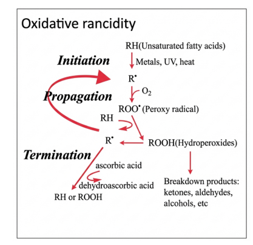
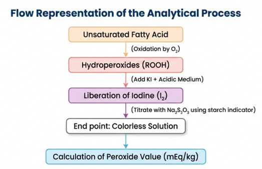

Oxidative rancidity is one of the most common causes of quality deterioration in edible oils and fats. It primarily involves the reaction of atmospheric oxygen with unsaturated fatty acids present in lipids. This reaction proceeds through a free radical chain mechanism consisting of initiation, propagation, and termination steps. 
 
Although hydroperoxides themselves are relatively odorless, they are unstable and decompose into secondary oxidation products such as aldehydes, ketones, and acids, which are responsible for rancid odor and flavor. 

Factors Affecting Oxidative Rancidity 

The extent of oxidation depends on: 
•	Degree of unsaturation of fatty acids 
•	Temperature (higher temperature accelerates oxidation) 
•	Exposure to light (photo-oxidation) 
•	Oxygen availability 
•	Moisture content 
•	Presence of pro-oxidant metals 
•	Storage duration 
Polyunsaturated oils oxidize more rapidly than saturated fats. 

Principle of Peroxide Value Determination 
Peroxide value (PV) measures the amount of hydroperoxides formed during lipid oxidation and is expressed as:
Milliequivalents of active oxygen per kilogram of fat (mEq/kg). 

The method is based on iodometric titration, where hydroperoxides oxidize iodide ions to iodine in acidic medium. 
Step 1: Liberation of Iodine 
ROOH + 2I⁻ + 2H⁺ → ROH + H₂O + I₂ 
The liberated iodine imparts a brown color to the solution. 

Step 2: Titration with Sodium Thiosulphate 
I₂ + 2S₂O₃²⁻ → S₄O₆²⁻ + 2I⁻ 
As sodium thiosulphate is added, the brown color fades. Near the endpoint, starch indicator is added, producing a blue complex with iodine. The disappearance of the blue color indicates the endpoint. Given below is a simplified flow representation of the analytical process. 
 
Interpretation of Peroxide Value 
•	Fresh oils: typically < 10 mEq/kg 
•	Moderate oxidation: 10–30 mEq/kg 
•	Rancid oils: 30–40 mEq/kg or higher 
However, very high peroxide values may sometimes decrease if hydroperoxides decompose into secondary oxidation products; therefore, peroxide value mainly indicates the early stages of oxidation. 
Thus, peroxide value determination provides a quantitative measure of primary lipid oxidation and serves as an essential quality control parameter in edible oil processing, storage, and safety evaluation.

<!--In oxidative rancidity oxygen is taken up by the fat with the formation of peroxides. The peroxide value is a useful indicator of the extent of oxidation of lipids, fats, and oils. The degree of peroxide formation and the time taken for the development of rancidity differ among oils. Time, temperature, light, air, exposed surface, moisture, and traces of metals are the major factors responsible for rancidity. The oxidation of food lipids is undesirable due to off-flavors, toxins, and loss of fat-soluble vitamins. In addition, the analysis of the peroxide content of oil samples is an important analytical task because high peroxide levels in oils have been a threat to human health. 

Peroxide value is defined as the milliequivalents of peroxide per kilogram of fat, as determined in a titration procedure to measure the amount of peroxide or hydroperoxide groups. The peroxides present are determined by titration against thiosulphate in the presence of KI. Starch is used as indicator. In general fresh oils have a peroxide value of <10 mEq/Kg while peroxide values in the range of 30-40 mEq/Kg are generally associated with a rancid taste.
The general reaction mechanism is as follows:

