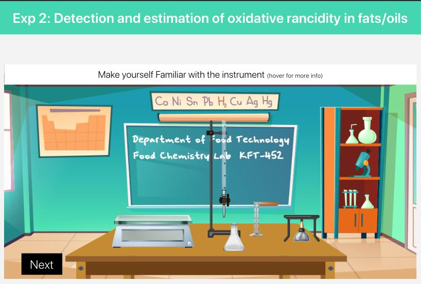
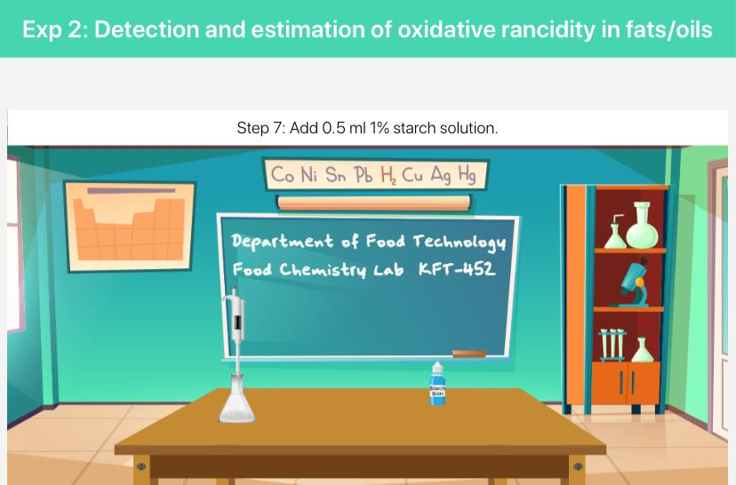

## Storyboard (Round 2)

Experiment 2: Detection and estimation of oxidative rancidity in fats/oils

### 1. Story Outline:

This experiment involves first of all selection of fats/oils sample and then preparing the sample for further analysis. To complete the experiment, titration of the sample is done in 2 parts. After that, titer volume (ml) used is recorded. Then on the basis of obtained data, peroxide value is determined and estimation of oxidative rancidity in fats/oils is done.
The main objective of this experiment is to determine peroxide value in fats and oils and estimate oxidative rancidity in fats/oils. During the operation student will be able to relate pre-learnt concepts and understand new concepts. Further, apply the concepts to analyze the sample and determine the peroxide value of fats/oils. Further based on the results, user will be able to estimate the oxidative rancidity.

### 2. Story:

First users will get themselves familiar with the experimental set-up and then select the desired sample of fats/oils to analyze oxidative rancidity in it. Then user will take conical flask, tare its weight and weigh 5.0 gm of selected sample. In case user has selected fat sample, first melt it and then weigh. After this, user will add 30 ml of acetic acid- chloroform solution, 0.5 ml saturated KI solution and then add 30 ml distilled water one by one to the sample conical flask. User will fill the burette with 0.1 N sodium thiosulphate solution and start titration of sample by opening knob of burette. User will observe the yellow color almost disappeared, then add 0.5 ml starch and once again start titration. Once blue color disappears, user will stop the process by closing knob of burette. User will record the volume of titrant and use it for calculation. After calculation and results, user can detect the oxidative rancidity in sample by determining the peroxide value.

#### 2.1 Set the Visual Stage Description:

In the simulator user will be able to see the virtual prototype of experimental set up resembling the actual experimental set up that is present in real time labs. Set up consists of 4 different fats/oils samples which are fresh oil, 1 time used oil, 2 times used oil and fresh ghee (fat) used. Hot plate will be used to melt the fat sample before weighing. An analytical balance is there to take the weight of samples and other reagents time to time during experiment. The burette setup will be used for the titration process with sodium thiosulphate and starch will be used as indicator to reach end point of titration.

#### 2.2 Set User Objectives & Goals:

1. The prime object of this experiment is to detect and estimate oxidative rancidity in fats/oils.
2. User will be able to relate the concept of sample selection.
3. User will be able to explain the concept of sample preparation.
4. User will be able to apply the knowledge of iodometric titration.
5. User will be able to analyze the sample by titrating it
6. User will be able to determine peroxide value and estimate oxidative rancidity of the sample

#### 2.3 Set the Pathway Activities:

1. As per experimental setup, there are 4 different fats/oils samples available. This all will be recognized by user as each have naming in the set up.
2. User will select 1 sample and weigh the sample by using analytical balance.
3. Fat sample is to be first melted and then weighed.
4. Then user will click to add 30 ml of acetic acid- chloroform solution in the sample flask.
5. User will add 0.5 ml saturated KI solution.
6. Then click to pour 30 ml distilled water in measuring cylinder and then to the sample conical flask.
7. User will drag the sample conical flask under burette having 0.1 N sodium thio-sulphate solution and press ‘Open knob’ Tab of the burette.
8. Simulator will display the titration process.
9. Once the yellow color of the sample is almost disappeared, user will press ‘Close knob’ Tab of the burette.
10. Then user will add 0.5 ml starch indicator which will turn the sample blue.
11. User will again perform titration and stop it once the blue color disappears.
12. Once titration is completed, user will press ‘Observations’ tab.
13. User will then press on the ‘Formula' tab, enter the manually calculated value in given space, press on the 'Check' tab & then 'Result' Tab.
14. Simulator will provide the result after calculation based on observed data.
15. Based on result of peroxide value, user will be able to estimate oxidative rancidity of fats/oils sample

##### 2.4 Set Challenges and Questions/Complexity/Variations in Questions:

Difficulty level: Remember (LO1) 
1. The term used for spoilage of fat is  
    a) Putrification 
    b) Esterification 
    <b>c) Rancidity</b> 
    d) Fractionation 

2. What is the required quantity of sample to be taken for peroxide value of oil/fat  
    <b>a) 0-5 gm</b>  
    b) 10-20 gm  
    c) 20-30 gm  
    d) 30-40 gm

    Difficulty level: Understand (LO2)
3. Oxidative rancidity in fats/oils is because of  
   <b> a) Peroxides formation</b>  
    b) Less mineral content  
    c) Moisture content  
    d) More saturated fatty acids

    Difficulty level: Apply (LO3)
4. Iodine gives……………color with starch   
    a) Orange   
    b) Purple  
    c) Red  
    <b>d) Blue</b>

##### 2.5 Allow pitfalls:

During the titration step, user will be allowed to over titrate the sample by continuing addition of titrant after color change (that indicates end point of titration). The pitfall will show ‘Over-titrated’ and user is not able to move to next step and user has to go back to the step 1 of sample preparation and perform again.

##### 2.6 Conclusion:

User will take approximate 8-10 minutes for understanding the procedure. Then for generating data by the help of simulator will take 10-12 minutes. After onwards for calculating result will take 2-3 minutes. Hence, total time taken for doing experiment will be approximately 20-25 minutes.

##### 2.7 Equations/formulas: 

The following equation is used to determine peroxide value in fats/oils:

 
Where,  
S= volume of sodium thiosulphate used (ml)  
N= Normality of sodium thiosulphate  
W= weight of sample (gm)
 

### 3. Flowchart:

 

### 4. Mindmap:

 
 

### 5. Storyboard :

